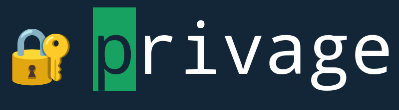

<p align="center"></p>

[](https://pkg.go.dev/github.com/revelaction/privage)
[](https://github.com/revelaction/privage/actions/workflows/test.yml)
[](https://github.com/revelaction/privage/actions/workflows/golangci-lint.yml)
[](https://goreportcard.com/report/github.com/revelaction/privage)
[](https://github.com/revelaction/privage/actions/workflows/test.yml)
[](https://github.com/revelaction/privage/actions/workflows/sloc.yml)
[](https://github.com/revelaction/privage/actions/workflows/dependencies.yml)
[]() 
[]()

`privage` is a terminal based password manager and general file encryption tool that
relies on [age](https://age-encryption.org/v1) for encryption. Optionally it uses a 
[yubikey](https://developers.yubico.com/PIV/) for encryption of the age key.

The main goal of privage is to have your secrets (credentials and other
files) securely backed up in untrusted 3-party repositories whitout revealing
any secret information (not even the file name) to those 3-party repositories.


**WARNING: The author is not a cryptographer, and the code has not been reviewed. Use at your own risk.**

You may want to use privage if:

- You want to have your encrypted credentials and other secrets files in a revision control system repository (ex: git)
- You want to have backups of this repository in untrusted 3 party services (github, gitlab, bitbucket)
- You do not want to leak any information (not even the name of the files) in
  case of a breach of those 3 party services, which you otherwise should always assume.
  privage guarantees not leaking information because it also encrypts the metadata of the files. 
- You want to have one encrypted file per credential or secret file.
- You trust the computer running privage. `privage` uses unencrypted `age`
  keys, following the reasoning
  [here](https://github.com/FiloSottile/age#passphrase-protected-key-files).
  privage supports yubikeys to encrypt the age secret key.  


# Features

- `privage` uses the golang [age API](https://github.com/FiloSottile/age/blob/main/age.go) for encryption of files.
- privage can use a yubikey (PIV smart card) to encrypt the age secret key. See [Yubikey](#markdown-header-yubikey)   
- privage uses `categories` to allow classification of the encrypted files. 
- Encrypted files do not reveal any metadata. `privage` encrypted files names are hashes of the file name and the category. See [design](#design)   
- privage encrypts any kind of file, not only credentials/passwords.
- privage can easily (with one command) change the secret key and reencode all the files with the new key. See [rotate](#rotate)   
- privage tries to be simple: it does not wrap `git` or your editor: Use git to control your
  repository and use your preferred editor to edit credentials files.
- Powerful command completion. All commands have completion. See [Bash Completion](#bash-completion)   

# Installation

On Linux you can use the [pre-built binaries](https://github.com/revelaction/privage/releases/)

If your system has a supported version of Go, you can build from source

## Dependencies

```console
sudo apt-get -y install pkg-config libpcsclite-dev libpcsclite1 pcscd pcsc-tools build-essential pkg-config
```

## privage

```console
 go install github.com/revelaction/privage/cmd...@v0.9.1-beta
```

# Usage

## Initialize a repository for your credentials and other encrypted files

Create a repository to contain your encrypted credentials and other secret
files. This repository can be pushed to untrusted 3-party services.

```console
mkdir /home/user/mysecrets
cd /home/user/mysecrets
git init
```

Now run `privage init`:  

```console
privage init
🔑 Generated age key file `/home/user/mysecrets/privage-key.txt` ✔️
📒 Generated `/home/user/mysecrets/.gitignore` file ✔️
📑 Generated config file .privage.conf ✔️
```
    
The `init` command does three things:

1. it creates a secret key file named `privage-key.txt` (if no one is found in
   the system). The key is a standard unencrypted `age` key or a [Yubikey](#markdown-header-yubikey)  
   encrypted age key.
2. it creates a `.gitignore` file to make sure that only encrypted (.age) files
   are commited in the repository. The file content is:

        # Ignore everything
        *

        # But not these files...
        !.gitignore
        !*.age

3. it creates a `.privage.conf` file in your home directory. The config file
   contains references to the secret key and the repository path. These
   references allows `privage` to be used in any directory of your computer.

To create a encrypted age secret key with a
[yubikey](#markdown-header-yubikey), add the flag `--piv-slot`, `-p` with the
yubikey slot that will be used to encrypt/decrypt the age key.

```console
privage init -p 86
🔑 Generated encrypted age key file `/home/user/src/privage/privage-key.txt` with PIV slot 86 ✔️
📒 Generated `/home/user/src/privage/.gitignore` file ✔️
📑 Generated config file .privage.conf ✔️
```

## Create a credentials file

In `privage`, credentials are structured text (`.toml` files), that can contain not only passwords, but any other
data associated with a website, like API keys, 2-factor backup codes, etc. 

To add a barebone credentials file (that you can later edit), use the command
`add`, specifying a `category` (for credential files it should always be
`credential`) and a `label` (any string that good describes the website, f.ex.
`somewebsite.com@loginname`).

```console
privage add credential somewebsite.com@loginname
An encrypted file was saved for 📖 somewebsite.com@loginname  🔖credential
```

`privage` will generate a random password, put the password (among other
fields) in a `.toml` file and encrypt that file under the `category`
'credential'.

It is recommended to use some naming convention for the credentials label, like
`<url>@loginname`

You can now list the encrypted file with: 

```console
ls -al

drwxrwxr-x  3 user user 4096 Sep 26 18:27 .
drwxr-xr-x 29 user user 4096 Sep 25 21:43 ..
-rw-rw-r--  1 user user  347 Sep 26 18:27 66ceb74807d0fd997566360b22ecbda1590ec35fbd3dd0ce88e15311a4e53faf.age
drwxrwxr-x  7 user user 4096 Sep 26 18:16 .git
-rw-------  1 user user    0 Sep 26 18:21 .gitignore
-rw-------  1 user user  189 Sep 26 18:21 privage-key.txt
```

That long `age` file is the encrypted credential file.  The label
(somewebsite.com@loginname) and the category (credential) were encrypted along
with the credential information.

## Encrypt any file

`privage` can encrypt any file. You can use any category and label. 

For example, to encrypt the file `secret-plan.doc` under the category
`work`:

```console
privage add work secret-plan.doc
```

## List the encrypted files

To list the encrypted files, use `list`:

```console
privage list
Found 2 total encrypted tracked files.

        📖 somewebsite.com@loginname  🔖credential
        💼 secret-plan.doc 🔖work
```


To list only encrypted files corresponding to the category `credential`:

```console
privage list credential
Found 1 files matching your category 'credential' of a total of 2 tracked files.

        📖 somewebsite.com@loginname  🔖credential
```

The `list` command accepts a string for matching the labels and categories:

```console
privage list somew
Found 1 files with name matching 'somew':

    📖 somewebsite.com@loginname  🔖credential
```


## Copy the password to the clipboard 

The command `clipboard` copies the credential password to the clipboard 

```console
privage clipboard somewebsite.com@loginname 
The password for `somewebsite.com@loginname` is in the clipboard
```

Use the flag `-d` (`--delete`) to empty the clipboard.

```console
privage clipboard -d 
```

## Show the contents of a credentials file

The command `show` presents in the terminal the login and the password of a credential file:

```console
privage show somewebsite.com@loginname

    Login:👤 loginname
    Password:🔑 ad81h4b54*)(y73
```

If the file is not a credential file, `privage` will ask you to use `cat`.

## Show a specific field of a credentials file

You can provide a second argument to `show` to print only the value of a specific TOML field. This is particularly useful for automation and shell scripts (e.g., to retrieve an API key).

```console
privage show somewebsite.com@loginname api_key
```

Supported field names (like `login`, `password`, `api_key`, `url`, etc.) can be autocompleted by pressing `[TAB]`.

## Cat the contents of an encrypted file

The command `cat` prints the decrypted contents of an encrypted file to the terminal (standard output). This is useful for piping to other commands or viewing the raw content of a file (including the full content of credential files).

```console
privage cat somewebsite.com@loginname
#
login = "loginname"
password = "ad8Q1hD4b54*)(y73"

email = ""
url = "somewebsite.com"
...
```

Or for regular files:

```console
privage cat secret-plan.doc
```


## Decrypt a file for manual edition

Use `decrypt` to decrypt the contents of a file:
    
```console
privage decrypt somewebsite.com@loginname
The file somewebsite.com@loginname was decrypted in the directory /home/user/mysecrets.

(Use "privage reencrypt --force" to reencrypt all decrypted files)
(Use "privage reencrypt --clean" to reencrypt all decrypted files and after that delete them)
```

`decrypt` will write a decrypted file in the repository directory. In the case
of credentials files, the decrypted file is a `.toml` file. You can use now
your favorite editor to change the password, user, email
and other predefined fields.

```console
vim somewebsite.com@loginname
```

After manually changing the file, you have to reencrypt the file...

## Reencrypt edited files

Use the `reencrypt` command to reencrypt `all` files that were decrypted and are present in
the repository directory:

```console
⤷ privage reencrypt
Found the following files to be reencrypted:

📖 somewebsite.com@me  🔖credential

(Use "privage reencrypt --force" to reencrypt all files)
(Use "privage reencrypt --clean" to reencrypt and also delete the decrypted files)
```

Without flags, `reencrypt` will only show (dry-run) the files that will be reencrypted.
Use the flag `-f` or `-c` to force the reencryption. 

## Delete a encrypted file 

the command `delete` deletes a encryted file:

```console
privage delete somewebsite.com@loginname
```

## Get information about the configuration

```console
⤷ privage status

🔑 Found age key file privage-key.txt in /home/user/mysecrets/privage-key.txt ✔️
📂 The directory of the encripted files is /home/user/mysecrets ✔️
📑 Found config file .privage.conf in /home/user/.privage.conf ✔️

     The configuration file /home/user/.privage.conf is up to date

🔐  Found 13 encrypted files for the age key /home/user/mysecrets/privage-key.txt
```


## Rotate 

The `rotate` command will create a new `age` secret key and reencrypt all files with this new key.
With the flag `--clean`, it will also delete the encrypted files with the old key, and will rename both old and new keys. 

To generate a new age key and reencrypt all the files:

```console
privage rotate
```

You can add the flag `--clean` to delete the old key encrypted files, and swap the secret key file names.


```console
private rotate --clean
```

To generate a yubikey encrypted age secret key, use the flag `--piv-slot`,
`-p`, to provide the yubikey slot that holds the key. See [possible
values](https://developers.yubico.com/PIV/Introduction/Certificate_slots.html). 


```console
# f. ex: use the 0x86 slot of the yubikey 5 
private rotate -p 86 --clean
```

# Design

The content of a `privage` encrypted file is the byte concatenation of two
`age` encrypted payloads:

The first encrypted payload (the header) contains the file name and a category
(plus a version of the header). This encrypted payload is padded to 512 bytes.


The second encrypted payload contains the file contents.

`privage` uses a **flat repository structure**: all encrypted `.age` files are
stored directly in the repository directory. Subdirectories are not supported
and are ignored during scanning.

When listing the encrypted files, `privage` scans all encrypted files, retrieves the
encrypted header payload and decrypts it, presenting the header.

When writing the encrypted file, `privage` hashes the header and the public age
key, and uses the hash as name of the encrypted file. Encrypted
`privage` file names look like this:

```console
425020f87e753ebe4dba67a872de04b7ce7350a63af9f74c1b7c4d633b41573c.age
5e107b8e3b57411d5661d05e54f755408dd12c831a6b63e8033885c211da1317.age
```


# Bash Completion

`privage` has builtin bash autocompletion. You can enable completion commands by putting the following bash
snippet in your `.bashrc` file:

```console
if command -v privage >/dev/null; then
    source <(privage bash)
fi
```

# Command line options

```console
⤷ privage help
NAME:
privage - password manager/encryption tool based on age

USAGE:
privage [global options] command [command options] [arguments...]

COMMANDS:
init       Add a .gitignore, age/yubikey key file to the current directory. Add a config file in the home directory.
key        Decrypt the age private key with the PIV key defined in the .privage.conf file.
status     Provide information about the current configuration.
add        Add a new encrypted file.
delete     Delete an encrypted file.
list       list metadata of all/some encrypted files.
show       Show the contents the an encripted file.
cat        Print the decrypted contents of an encrypted file to stdout.
clipboard  Copy the credential password to the clipboard
    decrypt    Decrypt a file and write its content in a file named after the label
reencrypt  Reencrypt all decrypted files that are already encrypted. (default is dry-run)
    rotate     Create a new age key and reencrypt every file with the new key
    bash       Dump bash complete script.
    help, h    Shows a list of commands or help for one command

    GLOBAL OPTIONS:
    --conf value, -c value        Use file as privage configuration file
    --key value, -k value         Use file path for private key
    --piv-slot value, -p value    The PIV slot for decryption of the age key
    --repository value, -r value  Use file path as path for the repository
    --help, -h                    show help
```
